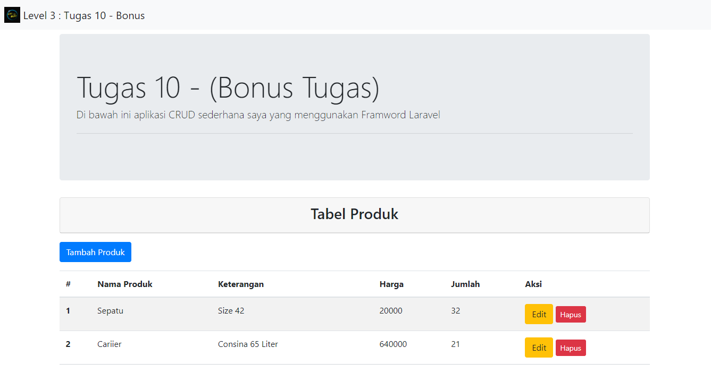
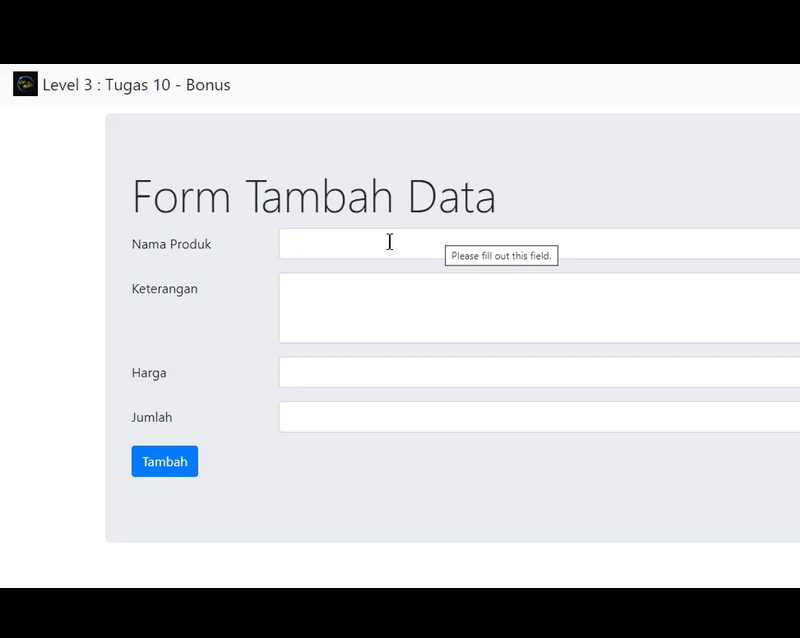
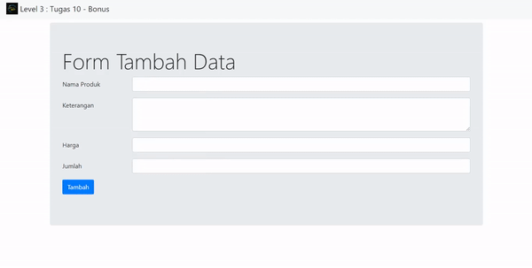
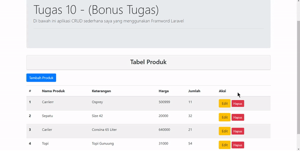
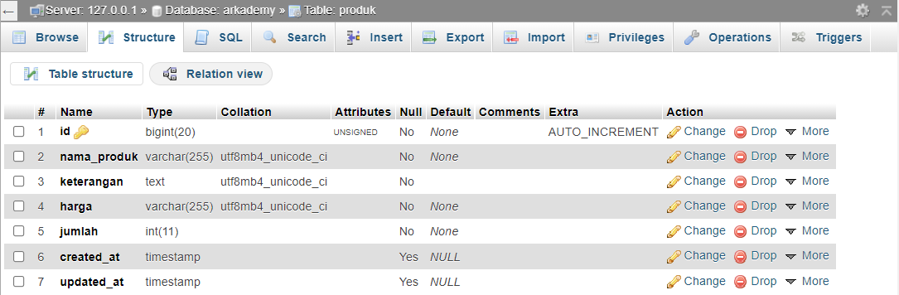

# Tugas 10 (Bonus Tugas)

**CRUD** Di sini saya menggunakan framework Laravel

 

Daftar isi
---------------------
1. [Website](#website)
    - [Read](#read)
    - [Create](#create)
    - [Edit](#edit)
    - [Delete](#delete)
2. [Database](#database)

 
 

## Website

## Read

 
 

## Create
Wrong Input

Success Input

 
 

## Edit

 
 

## Delete

 
 

## Database

